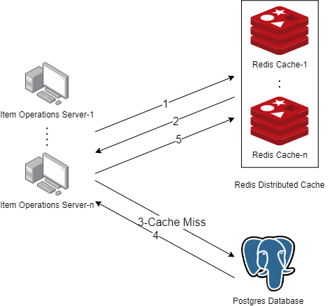

# Redis Cluster As Distributed Cache

This is a POC to show how to use Redis Cache Cluster as Distributed Cache

## Installation

```docker
docker compose up -d
```

## Redis

redis-cluster is only for creating cluster, after creation the container ends, but docker will try to restart, you can neglect it. We can check cluster has been created or not, by executing below commands

```docker
redis-cli

CLUSTER NODES

KEYS *
```

## System Design



